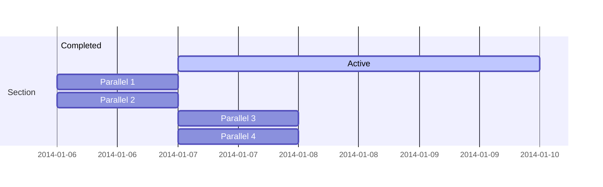

# Testing-automations-for-Jira

hej hej hej hej detta är nytt





```mermaid
   A(Coffee machine <br>not working) --> B{Machine has power?}
   B -->|No| H(Plug in and turn on)
   B -->|Yes| C{Out of beans or water?} -->|Yes| G(Refill beans and water)
   C -->|No| D{Filter warning?} -->|Yes| I(Replace or clean filter)
   D -->|No| F(Send for repair)
```
